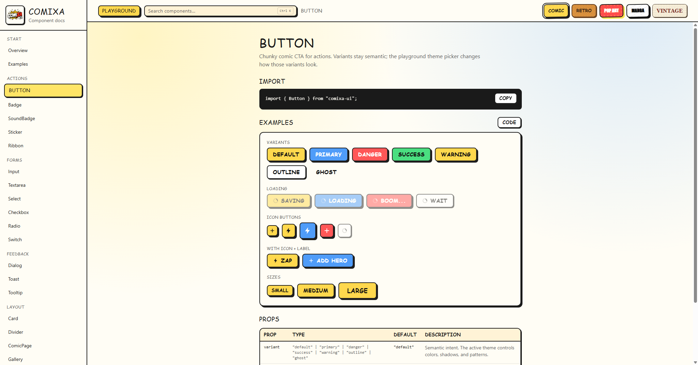

<p align="center">
  
</p>

<h1 align="center">Comic-inspired React UI Components.</h3>

<p align="center">
  
  
  
  
</p>

<p align="center">
  <a href="https://comixa-ui.vercel.app">
    
  </a>
  <a href="https://buymeacoffee.com/secenory">
    
  </a>
</p>

<p align="center">
  
</p>

Comic-themed React components built with **Tailwind CSS**. Hard shadows, ink borders, punchy motion.

```tsx
import {
  Button,
  ComixaProvider,
  ComicPanel,
  Features,
  Gallery,
  PageTransition,
  Textarea,
  Timeline,
  TimelineItem,
  toast,
  ToastProvider,
} from "comixa-ui";
```

## Install

```bash
npm i comixa-ui
```

Peer deps (required in your app):

```bash
npm i react react-dom tailwindcss
```

## Setup Tailwind

### 1. Use the Comixa UI preset

```js
// tailwind.config.js
const comixaPreset = require("comixa-ui/preset");

/** @type {import('tailwindcss').Config} */
module.exports = {
  presets: [comixaPreset],
  content: [
    "./src/**/*.{js,ts,jsx,tsx}",
    // IMPORTANT: scan the package so Tailwind keeps comic utility classes
    "./node_modules/comixa-ui/dist/**/*.{js,mjs,cjs}",
  ],
  theme: {
    extend: {},
  },
  plugins: [],
};
```

ESM:

```js
import comixaPreset from "comixa-ui/preset";

export default {
  presets: [comixaPreset],
  content: [
    "./src/**/*.{js,ts,jsx,tsx}",
    "./node_modules/comixa-ui/dist/**/*.{js,mjs,cjs}",
  ],
};
```

### 2. Optional fonts

```html
<link rel="preconnect" href="https://fonts.googleapis.com" />
<link
  href="https://fonts.googleapis.com/css2?family=Bangers&family=Comic+Neue:wght@400;700&display=swap"
  rel="stylesheet"
/>
```

## Usage

```tsx
import { ComixaProvider, Button, Input, Badge } from "comixa-ui";

export function Example() {
  return (
    <ComixaProvider theme="pop-art">
    <div className="flex flex-col gap-4 bg-paper p-8">
      <Badge variant="yellow">New</Badge>

      <Button>
        Pow!
      </Button>

      <Button variant="primary" size="lg">
        Continue
      </Button>

      <Button variant="danger">
        Boom
      </Button>

      <Input placeholder="Hero name..." />
      <Input state="error" placeholder="Try again..." />
      <Input variant="filled" state="success" placeholder="Looks good" />

      <Button theme="manga" variant="danger">
        Manga override
      </Button>
    </div>
    </ComixaProvider>
  );
}
```

## Themes

Wrap your app with `ComixaProvider` and every Comixa component inside it will
inherit that theme. Any component with a `theme` prop overrides the provider for
itself and its children.

```tsx
<ComixaProvider theme="retro">
  <Button>Retro button</Button>
  <Card theme="manga">
    <Button variant="danger">Manga button</Button>
  </Card>
</ComixaProvider>
```

Themes: `default`, `retro`, `pop-art`, `manga`, `vintage`.

### Button

| Prop | Values | Default |
|------|--------|---------|
| `variant` | `default` `primary` `danger` `success` `warning` `outline` `ghost` | `default` |
| `size` | `sm` `md` `lg` | `md` |
| `loading` | `true` / `false` | `false` |
| `icon` | `true` / `false` — square icon-only button | `false` |

```tsx
<Button loading>Saving…</Button>

<Button icon aria-label="Add">
  <PlusIcon />
</Button>
```

Button variants are semantic. Theme changes should come from CSS variables like
`--comixa-primary-bg`, `--comixa-danger-border`, and `--comixa-warning-shadow`.
Comixa also exports `defaultTheme`, `retroTheme`, `popArtTheme`, `mangaTheme`,
`vintageTheme`, and `comixaThemes` as token objects.

### Input

| Prop | Values | Default |
|------|--------|---------|
| `variant` | `default` `ghost` `filled` | `default` |
| `inputSize` | `sm` `md` `lg` | `md` |
| `state` | `default` `error` `success` | `default` |

### Textarea

Multiline field with the same ink-bordered form language as `Input`.

```tsx
<Textarea placeholder="Write your story..." />
<Textarea variant="filled" textareaSize="lg" resize="none" />
<Textarea state="error" defaultValue="This needs more punch." />
```

| Prop | Values | Default |
|------|--------|---------|
| `variant` | `default` `ghost` `filled` | `default` |
| `textareaSize` | `sm` `md` `lg` | `md` |
| `state` | `default` `error` `success` | `default` |
| `resize` | `none` `vertical` `horizontal` `both` | `vertical` |

### Badge

| Prop | Values | Default |
|------|--------|---------|
| `variant` | `yellow` `red` `blue` `green` `pink` `orange` `outline` `ink` `soft` | `yellow` |
| `size` | `sm` `md` `lg` | `md` |

### Select

Custom listbox (not a native `<select>`). Arrow stays on the right.

```tsx
<Select
  value={hero}
  onValueChange={setHero}
  variant="filled"
  placeholder="Pick a hero"
  options={[
    { value: "zap", label: "Captain Zap" },
    { value: "boom", label: "Boom Knight" },
  ]}
/>
```

| Prop | Values / notes | Default |
|------|--------|---------|
| `options` | `{ value, label, disabled? }[]` | required |
| `value` / `defaultValue` | string | — |
| `onValueChange` | `(value: string) => void` | — |
| `variant` | `default` `ghost` `filled` | `default` |
| `selectSize` | `sm` `md` `lg` | `md` |
| `state` | `default` `error` `success` | `default` |
| `classNames` | `root` `trigger` `value` `placeholder` `icon` `list` `option` `optionActive` | — |

### Checkbox / Radio / Switch

| | Checkbox | Radio | Switch |
|--|--|--|
| `variant` | `default` `primary` `danger` `success` `pink` | — | `default` `primary` `danger` `success` `pink` |
| size prop | `checkboxSize`: `sm` `md` `lg` | `radioSize`: `sm` `md` `lg` | `switchSize` |
| extras | `label` | `label`, `invalid`, native `disabled` | `checked`, `onCheckedChange`, `label` |

`RadioGroup` wraps radios (`orientation`: `horizontal` \| `vertical`).

### Avatar

| Prop | Values | Default |
|------|--------|---------|
| `variant` | `default` `yellow` `blue` `red` `green` `pink` `ink` | `default` |
| `size` | `sm` `md` `lg` `xl` | `md` |
| `shape` | `rounded` `square` `circle` | `rounded` |

Also: `src`, `name` (initials), `fallback`, plus `AvatarGroup`.

### Tooltip

```tsx
<Tooltip content="Hello!" side="top" variant="pop">
  <Button>Hover me</Button>
</Tooltip>
```

| Prop | Values | Default |
|------|--------|---------|
| `side` | `top` `right` `bottom` `left` | `top` |
| `variant` | `default` `pop` `paper` `danger` `success` `blue` | `default` |
| `delay` | ms | `120` |

### SpeechBubble

Classic comic dialogue bubble (no boom/explosion).

```tsx
<SpeechBubble shape="speech" tone="cream" tail="bottomLeft">
  Hey! Did you see that?
</SpeechBubble>
<SpeechBubble shape="thought" tail="bottomRight">
  Hmm…
</SpeechBubble>
```

| Prop | Values | Default |
|------|--------|---------|
| `shape` | `speech` `thought` | `speech` |
| `tone` | `default` `pop` `danger` `blue` `pink` `cream` | `default` |
| `size` | `sm` `md` `lg` | `md` |
| `tail` | `bottomLeft` `bottomRight` `bottom` `none` | `bottomLeft` |

### ComicPage

Comic-strip grid. `layout="2-1"` = two panels on top, one full-width below.
`ComicPanel` can also be used on its own as a cover-grade hero panel.

```tsx
<ComicPage layout="2-1">
  <ComicPanel caption="1">Top left</ComicPanel>
  <ComicPanel caption="2">Top right</ComicPanel>
  <ComicPanel variant="alert">Wide bottom</ComicPanel>
</ComicPage>

<ComicPanel variant="hero" shadow="xl" halftone tilt hover>
  <ComicHero />
</ComicPanel>
```

Layouts: `1` `1-1` `2` `2-1` `1-2` `2-2` `3` `1-1-1`

Panel variants: `default` `cream` `sky` `alert` `pop` `night` `hero`  
Panel shadow: `none` `sm` `md` `lg` `xl`  
Panel flags: `halftone`, `tilt`, `hover`

### SoundBadge

```tsx
<SoundBadge variant="pow" />
<SoundBadge variant="boom" burst />
<SoundBadge variant="bam" word="SNAP!" />
```

Variants: `pow` `bam` `wow` `boom` `zap` `crash` `wham` `bang` `kapow` `splash`

### Divider

`variant`: `solid` `dashed` `zigzag` `dots` `burst` — optional `label`

### Sticker

`variant` colors + `tilt` (`none` `left` `right` `wild`) + `shape` (`square` `circle` `ticket`)

### Ribbon

Comic promo labels for launch pages, tickets, corners, and bursts.

```tsx
<Ribbon variant="banner">New issue</Ribbon>
<Ribbon variant="corner" tilt="right">Hot</Ribbon>
<Ribbon variant="ticket">Limited</Ribbon>
<Ribbon variant="burst">Pow</Ribbon>
```

| Prop | Values | Default |
|------|--------|---------|
| `variant` | `banner` `corner` `ticket` `burst` | `banner` |
| `size` | `sm` `md` `lg` | `md` |
| `tilt` | `none` `left` `right` | `none` |

### Card

| Prop | Values | Default |
|------|--------|---------|
| `variant` | `default` `cream` `pop` `panel` `danger` `speech` `outline` | `default` |
| `padding` | `none` `sm` `md` `lg` | `md` |
| `effect` | `none` `pop` `wiggle` | `none` |

Parts: `CardHeader`, `CardTitle`, `CardDescription`, `CardContent`, `CardFooter`.

```tsx
<Card variant="speech">
  <CardHeader>
    <CardTitle>Caption</CardTitle>
    <CardDescription>A comic speech bubble.</CardDescription>
  </CardHeader>
  <CardContent>Pow!</CardContent>
</Card>
```

### Dialog (Modal)

| Prop (root) | Values | Default |
|------|--------|---------|
| `open` | `boolean` | required |
| `onOpenChange` | `(open: boolean) => void` | required |

| Prop (`DialogContent`) | Values | Default |
|------|--------|---------|
| `variant` | `default` `cream` `boom` `alert` `success` `panel` | `default` |
| `size` | `sm` `md` `lg` | `md` |
| `effect` | `none` `pop` `shake` | `pop` |

```tsx
const [open, setOpen] = useState(false);

<>
  <Button onClick={() => setOpen(true)}>Open</Button>
  <Dialog open={open} onOpenChange={setOpen}>
    <DialogContent variant="boom">
      <DialogHeader>
        <DialogTitle>Boom!</DialogTitle>
        <DialogDescription>Something exploded (in a good way).</DialogDescription>
      </DialogHeader>
      <DialogFooter>
        <Button onClick={() => setOpen(false)}>Got it</Button>
      </DialogFooter>
    </DialogContent>
  </Dialog>
</>
```

### Navbar

Customizable compound navbar — every part accepts `className`.

| Prop (`Navbar`) | Values | Default |
|------|--------|---------|
| `variant` | `default` `cream` `pop` `panel` `ink` `transparent` | `default` |
| `position` | `static` `sticky` `fixed` | `static` |

Parts: `NavbarBrand`, `NavbarContent`, `NavbarMenu`, `NavbarLink`, `NavbarActions`, `NavbarItem`, `NavbarToggle`, `NavbarMobileMenu`.

```tsx
<Navbar variant="pop" position="sticky" className="px-6">
  <NavbarBrand href="/" className="text-ink">Comixa</NavbarBrand>
  <NavbarContent>
    <NavbarMenu className="gap-2">
      <NavbarLink href="/" active className="shadow-comic">Home</NavbarLink>
      <NavbarLink href="/docs">Docs</NavbarLink>
    </NavbarMenu>
  </NavbarContent>
  <NavbarActions className="gap-3">
    <Button size="sm">Join</Button>
    <NavbarToggle className="bg-comic-yellow" />
  </NavbarActions>
  <NavbarMobileMenu className="bg-paper-cream">
    <NavbarLink href="/">Home</NavbarLink>
    <NavbarLink href="/docs">Docs</NavbarLink>
  </NavbarMobileMenu>
</Navbar>
```

### Toast

Wrap your app with `ToastProvider`, then call `toast()` anywhere.

```tsx
<ToastProvider
  position="bottom-right"
  duration={3500}
  closable
  viewportClassName="p-2"
>
  <App />
</ToastProvider>

toast({ title: "Pow!", description: "Saved.", variant: "success" });
toast.success("Done");
toast.danger("Oops", "Try again");

// Duration (ms). 0 or Infinity = stay until dismissed
toast({ title: "Quick", duration: 1000 });
toast({ title: "Sticky", duration: 0 });

// Hide the × button
toast({ title: "No close", closable: false, duration: 3000 });

// Per-toast position (overrides provider default)
toast({ title: "Top!", position: "top-center" });
toast.info("Hi", "From the corner", { position: "top-left", duration: 5000 });

// Custom classes per slot
toast({
  title: "Styled",
  className: "max-w-sm",
  classNames: {
    root: "rounded-2xl",
    title: "text-comic-red",
    description: "opacity-80",
    close: "bg-comic-yellow",
  },
});
```

| | |
|--|--|
| Variant | `default` `pop` `success` `danger` `info` |
| Position | `top-left` `top-right` `top-center` `bottom-left` `bottom-right` `bottom-center` |
| `duration` | ms number — `0` / `Infinity` keeps toast open |
| `closable` | `true` / `false` — show/hide × button |

### Testimonials / Features / Pricing / FAQ / Stats

Compound marketing sections:

```tsx
import {
  Features,
  Feature,
  Testimonials,
  Testimonial,
  Pricing,
  PricingTier,
  FAQ,
  FAQItem,
  Stats,
  Stat,
  Button,
  Avatar,
} from "comixa-ui";

<Testimonials columns={3}>
  <Testimonial
    quote="Pow!"
    author="Captain Zap"
    role="Hero"
    rating={5}
    avatar={<Avatar name="CZ" size="sm" shape="circle" />}
  />
</Testimonials>

<Features columns={3}>
  <Feature
    variant="yellow"
    title="Hero panels"
    description="Cover-grade panels with halftone and hard shadows."
  />
  <Feature
    variant="blue"
    title="Composable"
    description="Stack sections without leaving the comic visual language."
  />
</Features>

<Pricing>
  <PricingTier
    name="Hero"
    price="$19"
    period="mo"
    featured
    badge="Popular"
    features={["All components"]}
    cta={<Button className="w-full">Start</Button>}
  />
</Pricing>

<FAQ type="single" defaultValue="a">
  <FAQItem value="a" title="What is Comixa?">
    Comic React UI with Tailwind.
  </FAQItem>
</FAQ>

<Stats columns={4}>
  <Stat value="12k+" label="Heroes" animate />
</Stats>
```

Feature variants: `default` `yellow` `blue` `burst` `outline`  
Feature alignment: `left` `center`  
Features columns: `1` `2` `3` `4`

### Gallery

Image galleries for covers, portfolio work, products, and proof sections.

```tsx
const items = [
  {
    src: "/covers/neon.jpg",
    alt: "Neon skyline",
    title: "Neon Alley",
    description: "Campaign cover.",
    badge: "New",
  },
  {
    src: "/covers/road.jpg",
    alt: "Desert road",
    title: "Road Cut",
    badge: "Hot",
  },
];

<Gallery variant="featured" items={items} />
<Gallery variant="strip" items={items} />
```

| Prop | Values / notes | Default |
|------|--------|---------|
| `variant` | `grid` `strip` `featured` | `grid` |
| `items` | `{ src, alt, title?, description?, badge? }[]` | required |
| `framed` | `true` / `false` | `true` |

`variant="featured"` makes the first image the featured card.  
`variant="strip"` supports horizontal wheel scrolling and mouse drag scrolling.

### Timeline

Comic resume, launch, roadmap, and origin-story timelines.

```tsx
<Timeline variant="roomy">
  <TimelineItem
    period="2024 - Today"
    title="Senior Frontend Dev - TechCo"
    description="Led the design system and rebuilt the product UI."
    color="red"
    tilt="right"
  />
  <TimelineItem
    period="2021 - 2024"
    title="Frontend Developer - StartupX"
    description="Scaled an MVP to 1M users."
    color="yellow"
    tilt="left"
  />
</Timeline>
```

Timeline variants: `default` `compact` `roomy`  
Line styles: `dashed` `solid` `none`  
Item colors: `red` `yellow` `blue` `orange` `pink` `green`  
Item tilt: `none` `left` `right`

### PageTransition

Replayable content/page enter transitions.

```tsx
<PageTransition variant="panel-swipe" transitionKey={routeId}>
  <YourPage />
</PageTransition>
```

Variants: `panel-swipe` `burst` `flip` `speed-lines`  
Props: `transitionKey`, `duration`, `easing`, `padding`

### Loader Animation

```tsx
<ComicLoader variant="dots" />
<ComicLoader variant="burst" label="Zap" tone="red" />
```

Variants: `dots` `burst` `panel` `speech`  
Tones: `yellow` `blue` `red` `green` `pink`

### Reveal Animation

Replayable section reveals.

```tsx
<ComicReveal variant="panel-wipe" revealKey={id}>
  <Card>Fresh panel</Card>
</ComicReveal>

<ComicReveal variant="pop" triggerOnView>
  <Card>Reveals when visible</Card>
</ComicReveal>
```

Variants: `pop` `slide-up` `panel-wipe` `spotlight`  
Props: `revealKey`, `delay`, `duration`, `triggerOnView`, `once`

### Cursor

Theme-ready cursor follower. Mount it once on a page.

```tsx
<CursorFollow enabled animated showLabel />
<ComicCursor variant="pop-art" trailCount={6} />

<button data-comixa-cursor-zone>
  Hovering this grows and fades the follower
</button>
```

Theme variants: `comic` `retro` `pop-art` `manga` `vintage`  
Legacy variants: `dot` `ring` `spark`  
Props: `enabled`, `animated`, `showLabel`, `hideNativeCursor`, `behindOnHover`, `size`, `trailCount`

### Animated text

`repeat` controls how many times the animation plays (`Infinity` = forever, default).
Use `triggerOnView` to start the animation when the element enters the viewport.

```tsx
import { LetterReveal, Typewriter, ComicText, Highlight } from "comixa-ui";

<LetterReveal repeat={Infinity}>Boom Town</LetterReveal>
<LetterReveal repeat={3}>Three times</LetterReveal>

<Typewriter speed={40} repeat={Infinity}>Typing with ink…</Typewriter>
<Typewriter repeat={1}>Once only</Typewriter>

<ComicText effect="pop" tilt="left" repeat={Infinity}>Kapow!</ComicText>
<ComicText effect="pop" triggerOnView repeat={1}>On screen!</ComicText>

<p>
  Ship <Highlight tone="yellow" repeat={Infinity}>faster</Highlight> pages.
</p>
```

Viewport trigger props: `triggerOnView`, `once`

### Background

```tsx
import {
  DotsBackground,
  GridBackground,
  ExplosionBackground,
  ComicPaperBackground,
  PopArtBackground,
  VintagePaperBackground,
} from "comixa-ui";

<DotsBackground className="rounded-xl p-8" intensity="md">
  Hero copy
</DotsBackground>
<PopArtBackground className="rounded-xl p-8">Pop art</PopArtBackground>
<VintagePaperBackground className="rounded-xl p-8">Vintage paper</VintagePaperBackground>
```

Variants: `dots` `grid` `lines` `pattern` `explosion` `comic-paper` `pop-art` `vintage-paper`  
Tone: `paper` `cream` `yellow` `ink` · Intensity: `sm` `md` `lg`

## Design tokens (via preset)

- Colors: `ink`, `paper`, `comic.yellow|red|blue|green|pink|orange`
- Shadows: `shadow-comic`, `shadow-comic-sm`, `shadow-comic-lg`
- Animations: `animate-comic-pop`, `animate-comic-shake`, `animate-comic-wiggle`, `animate-comic-dialog-in`, `animate-comic-overlay-in`, `animate-comic-letter-in`, `animate-comic-caret-blink`, `animate-comic-highlight-wipe`
- Fonts: `font-comic`, `font-body`
